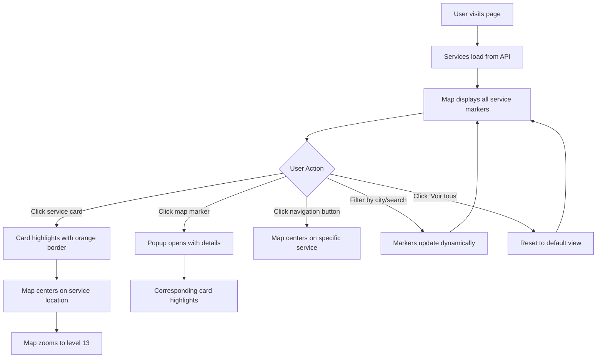
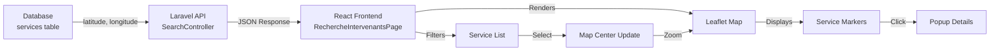

# How the Map Shows Service Localization

This document explains how the Services Manager application displays service locations on an interactive map.

---

## Table of Contents

1. [Overview](#overview)
2. [Database Storage](#1-database-storage-backend)
3. [API Data Retrieval](#2-api-data-retrieval)
4. [Frontend Map Display](#3-frontend-map-display)
5. [User Interaction Flow](#4-user-interaction-flow)
6. [Key Features](#5-key-features)

---

## Overview

The application uses a sophisticated geolocation system that combines:
- **Backend**: Laravel database storing latitude/longitude coordinates
- **API**: RESTful endpoints serving location data
- **Frontend**: React + Leaflet for interactive map visualization

---

## 1. Database Storage (Backend)

### Location Data Storage

Each service in the database stores geographic information in the `services` table:

| Field | Type | Description |
|-------|------|-------------|
| `latitude` | `decimal(10,8)` | Latitude coordinate (e.g., 48.8566) |
| `longitude` | `decimal(11,8)` | Longitude coordinate (e.g., 2.3522) |
| `ville` | `string(100)` | City name |
| `adresse` | `string` | Full address |
| `rayon_km` | `integer` | Service radius in kilometers (default: 20) |

**Migration Definition:**

```php
// File: backend/database/migrations/2025_12_10_224818_create_services_table.php
$table->decimal('latitude', 10, 8)->nullable();
$table->decimal('longitude', 11, 8)->nullable();
$table->string('ville', 100)->nullable();
$table->string('adresse')->nullable();
$table->integer('rayon_km')->default(20);
```

**Model Configuration:**

```php
// File: backend/app/Models/Service.php
protected $casts = [
    'latitude' => 'decimal:8',
    'longitude' => 'decimal:8',
    'rayon_km' => 'integer',
];
```

---

## 2. API Data Retrieval

### SearchController Endpoint

**Route:** `GET /api/search`

The [SearchController](backend/app/Http/Controllers/API/Client/SearchController.php) handles service searches with location filtering:

#### Query Filters

```php
// Only return services with valid coordinates
->whereNotNull('latitude')
->whereNotNull('longitude')

// Optional filters
if ($ville) {
    $query->where('ville', $ville);
}

if ($typeService) {
    $query->where('type_service', $typeService);
}
```

#### Response Format

```json
{
  "success": true,
  "data": [
    {
      "id": 1,
      "titre": "Installation électrique complète",
      "description": "Expert en installation électrique...",
      "type_service": "electricite",
      "ville": "Paris",
      "adresse": "123 Rue Example",
      "lat": 48.8566,
      "lng": 2.3522,
      "intervenant": {
        "id": 5,
        "nom": "Dupont",
        "prenom": "Jean",
        "surnom": "ElectricPro"
      },
      "rating": 4.5,
      "nbAvis": 12,
      "missions_completees": 45,
      "categories": [...],
      "disponibilites": ["lundi", "mardi", "mercredi"]
    }
  ],
  "count": 15
}
```

---

## 3. Frontend Map Display

### Technology Stack

- **Leaflet**: Open-source JavaScript library for interactive maps
- **React-Leaflet**: React components for Leaflet
- **OpenStreetMap**: Free tile provider for map imagery

### Component Structure

**File:** [frontend/src/pages/RechercheIntervenantsPage.jsx](frontend/src/pages/RechercheIntervenantsPage.jsx)

#### A. Map Initialization

```javascript
<MapContainer
  center={mapCenter}
  zoom={6}
  className="h-full w-full"
>
  <TileLayer
    url="https://{s}.tile.openstreetmap.org/{z}/{x}/{y}.png"
    attribution='&copy; OpenStreetMap contributors'
  />
</MapContainer>
```

**Default Center:** `[46.603354, 1.888334]` (Center of France)

#### B. Marker Placement

Each service is rendered as a marker at its coordinates:

```javascript
{filteredIntervenants.map((intervenant) => (
  <Marker
    key={intervenant.id}
    position={[intervenant.lat, intervenant.lng]}
    eventHandlers={{
      click: () => setSelectedIntervenant(intervenant)
    }}
  >
    <Popup>
      {/* Service details */}
    </Popup>
  </Marker>
))}
```

#### C. Custom Icons by Service Type

Services are visually distinguished by color-coded markers:

| Service Type | Icon | Color | Hex Code |
|--------------|------|-------|----------|
| Menuiserie (Carpentry) | 🔨 | Orange | #D97706 |
| Peinture (Painting) | 🎨 | Brown | #B45309 |
| Électricité (Electricity) | ⚡ | Green | #15803d |

**Icon Creation:**

```javascript
const createCustomIcon = (service, isSelected = false) => {
  const colors = {
    menuiserie: '#D97706',
    peinture: '#B45309',
    electricite: '#15803d',
  };
  
  const icons = {
    menuiserie: '🔨',
    peinture: '🎨',
    electricite: '⚡',
  };
  
  const size = isSelected ? 45 : 35;
  const color = colors[service] || '#666666';
  const icon = icons[service] || '👤';
  
  return L.divIcon({
    html: `<div style="
      background-color: ${color};
      width: ${size}px;
      height: ${size}px;
      border-radius: 50%;
      display: flex;
      align-items: center;
      justify-content: center;
      border: 3px solid white;
      box-shadow: 0 4px 6px rgba(0,0,0,0.3);
      font-size: ${size * 0.5}px;
    ">${icon}</div>`,
    iconSize: [size, size],
  });
};
```

#### D. Interactive Popups

Clicking a marker displays a popup with:

- ✅ Service image
- ✅ Service title
- ✅ Intervenant name
- ✅ Location (city)
- ✅ Service type badge
- ✅ Star rating and review count
- ✅ Pricing information

```javascript
<Popup>
  <div className="p-3">
    
    <h3>{intervenant.titre}</h3>
    <p>Par: {intervenant.intervenant?.surnom}</p>
    <div>
      <MapPin /> {intervenant.ville}
    </div>
    <div>
      <Star /> {intervenant.rating} ({intervenant.nbAvis} avis)
    </div>
  </div>
</Popup>
```

#### E. Dynamic Map Centering

The `MapController` component automatically centers the map when a service is selected:

```javascript
function MapController({ center }) {
  const map = useMap();
  useEffect(() => {
    if (center && center[0] && center[1]) {
      map.setView(center, 13); // Zoom level 13 for detail
    }
  }, [center, map]);
  return null;
}

// Usage
const mapCenter = selectedIntervenant
  ? [selectedIntervenant.lat, selectedIntervenant.lng]
  : [46.603354, 1.888334];
```

#### F. Map Legend

A visual legend helps users identify service types:

```javascript
<div className="absolute bottom-4 left-4 bg-white/95 rounded-lg shadow-xl p-4">
  <div className="text-sm font-bold mb-3">Légende</div>
  <div className="space-y-2">
    <div className="flex items-center gap-3">
      <div className="w-5 h-5 rounded-full bg-amber-600"></div>
      <span>Menuiserie</span>
    </div>
    <div className="flex items-center gap-3">
      <div className="w-5 h-5 rounded-full bg-orange-600"></div>
      <span>Peinture</span>
    </div>
    <div className="flex items-center gap-3">
      <div className="w-5 h-5 rounded-full bg-green-700"></div>
      <span>Électricité</span>
    </div>
  </div>
</div>
```

---

## 4. User Interaction Flow

### Step-by-Step User Journey



### Interaction Details

1. **Service List (Left Side)**
   - Displays all available services
   - Filters: Search term, city selection
   - Shows count: "X intervenant(s) trouvé(s)"

2. **Click a Service Card**
   - ✅ Highlights card with orange border and ring effect
   - ✅ Centers map on service coordinates
   - ✅ Zooms to level 13 for detailed view
   - ✅ Scales marker to 1.2x size

3. **Click a Map Marker**
   - ✅ Opens popup with service information
   - ✅ Selects corresponding service in list
   - ✅ Scrolls list to show selected service

4. **Navigation Button (📍)**
   - ✅ Directly centers map on specific service
   - ✅ Provides quick access to location

5. **Filter Actions**
   - ✅ Real-time map updates
   - ✅ Markers appear/disappear based on filters
   - ✅ Service count updates automatically

---

## 5. Key Features

### ✅ Real-time Filtering

The map updates dynamically when users apply filters:

```javascript
const filteredIntervenants = useMemo(() => {
  return intervenants.filter(intervenant => {
    const matchService = !serviceType || intervenant.service === serviceType;
    const matchSearch = !searchTerm ||
      intervenant.surnom.toLowerCase().includes(searchTerm.toLowerCase()) ||
      intervenant.description.toLowerCase().includes(searchTerm.toLowerCase());
    const matchVille = !selectedVille || intervenant.ville === selectedVille;
    
    return matchService && matchSearch && matchVille;
  });
}, [intervenants, serviceType, searchTerm, selectedVille]);
```

### ✅ Responsive Design

- **Desktop**: Sticky map on right side, scrollable list on left
- **Mobile**: Stacked layout, map below service list
- **Height**: `lg:h-[calc(100vh-120px)]` for optimal viewing

### ✅ Visual Feedback

- **Selected Service**: Larger marker (45px vs 35px), scale transform
- **Hover Effects**: Card elevation, border color changes
- **Loading States**: Spinner animation while fetching data
- **Error States**: User-friendly error messages with retry button

### ✅ Service Count Display

```javascript
<p className="text-amber-100 text-sm mt-1">
  {filteredIntervenants.length} service{filteredIntervenants.length > 1 ? 's' : ''} 
  disponible{filteredIntervenants.length > 1 ? 's' : ''}
</p>
```

### ✅ Reset View

"Voir tous" button returns to default map view:

```javascript
{selectedIntervenant && (
  <button
    onClick={() => setSelectedIntervenant(null)}
    className="absolute top-4 right-4 bg-white/95 rounded-lg shadow-xl px-4 py-2"
  >
    Voir tous
  </button>
)}
```

### ✅ Performance Optimization

- **useMemo**: Prevents unnecessary recalculations
- **Lazy Loading**: Map components load on demand
- **Image Fallbacks**: Default images if service image fails to load

```javascript
onError={(e) => {
  e.target.src = 'https://images.unsplash.com/photo-1581578731548-c64695cc6952';
}}
```

---

## Architecture Diagram



---

## Summary

This geolocation system provides an **intuitive, visual way** for users to:

🗺️ **Browse services by location** - See all available services on an interactive map  
🎯 **Find nearby intervenants** - Filter by city and service type  
📍 **Understand geographic coverage** - Visual representation of service areas  
⭐ **Make informed decisions** - View ratings, reviews, and details directly on the map  
🔄 **Seamless interaction** - Synchronized list and map views

The combination of **precise database storage**, **efficient API delivery**, and **rich frontend visualization** creates a powerful tool for connecting clients with local service providers!

---

**Last Updated:** December 12, 2025  
**Version:** 1.0
